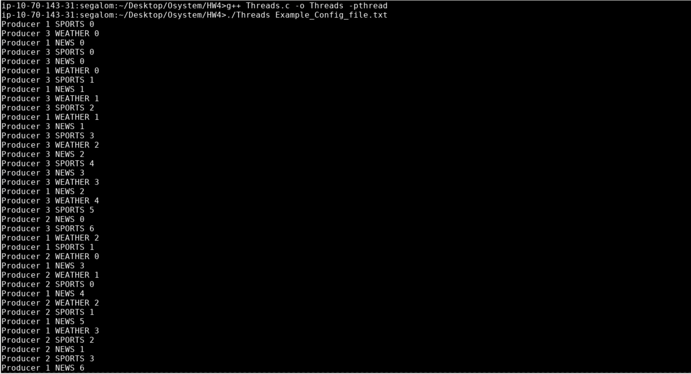
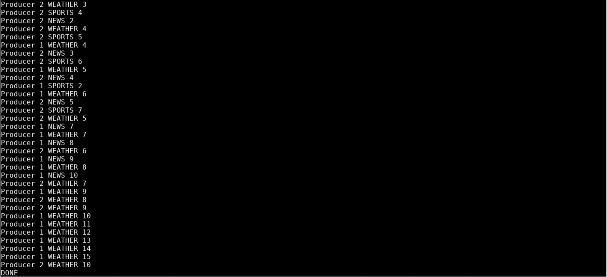

# Multi-threaded News Distribution System

This project implements a multi-stage **message distribution and processing simulation** using the producer-consumer model. It demonstrates advanced concurrency and synchronization techniques in C++ using POSIX threads, semaphores, and mutexes.

## Overview
The system simulates a real-time news pipeline where stories (Sports, News, and Weather) are generated by multiple sources, sorted by a central dispatcher, edited, and finally displayed.

### The Workflow:
* **Producers:** Multiple threads generate a specified number of messages and push them into private Bounded Buffers.
* **Dispatcher:** A single thread that scans all producer queues using a non-blocking `tryRemove` method, sorting messages into three type-specific Unbounded Buffers.
* **Co-Editors:** Three dedicated threads (one for each news category) that "edit" messages by simulating a 0.1-second delay (`usleep(100000)`) before passing them to the final shared queue.
* **Screen Manager:** The final consumer that retrieves edited messages from the shared Bounded Buffer and prints them to the terminal. It terminates gracefully after receiving "DONE" signals from all three editors.

## System Architecture
The system relies on two synchronized, thread-safe data structures:
* **Bounded Buffer:** A fixed-size queue that uses a Mutex and two Semaphores (`full_slots`, `empty_slots`) to manage capacity and prevent race conditions.
* **Unbounded Buffer:** A queue with no size limit that uses a Mutex and a single Semaphore for signaling.

## Configuration File (`Example_Config_file.txt`)
The system's behavior is driven by a configuration file. Each producer block defines the production count and the specific queue size for that source.

[cite_start][cite: 1]
PRODUCER 1
30
queue size = 5

PRODUCER 2
25
queue size = 3    

PRODUCER 3
16
queue size = 30

Co-Editor queue size = 17

* **PRODUCER X:** Defines the unique ID of the producer source.
* **Count:** The total number of items this specific producer will generate (e.g., 30, 25, or 16).
* **Queue Size:** The capacity of the Bounded Buffer between that producer and the Dispatcher.
* **Co-Editor queue size:** The capacity of the final shared Bounded Buffer leading to the Screen Manager.

## Execution & Results

### Compilation
The program is compiled using `g++` with the `pthread` library:
`g++ Threads.c -o Threads -pthread`

### Running the System
To run the simulation, pass the configuration file as a command-line argument:
`./Threads Example_Config_file.txt`

### Demonstration
The following images illustrate the system processing the provided configuration:

**Part 1: Initial Execution**
Producers concurrently generate messages while the Dispatcher begins sorting them.

**Part 2: Graceful Termination**
The Screen Manager prints the final messages and a "DONE" signal.

## Technical Stack
* **Language:** C++
* **Concurrency:** `pthreads` for multi-threading
* **Synchronization:** `pthread_mutex_t` and `sem_t` (Semaphores)
* **Optimization:** Non-blocking queue polling for the Dispatcher to prevent deadlocks.